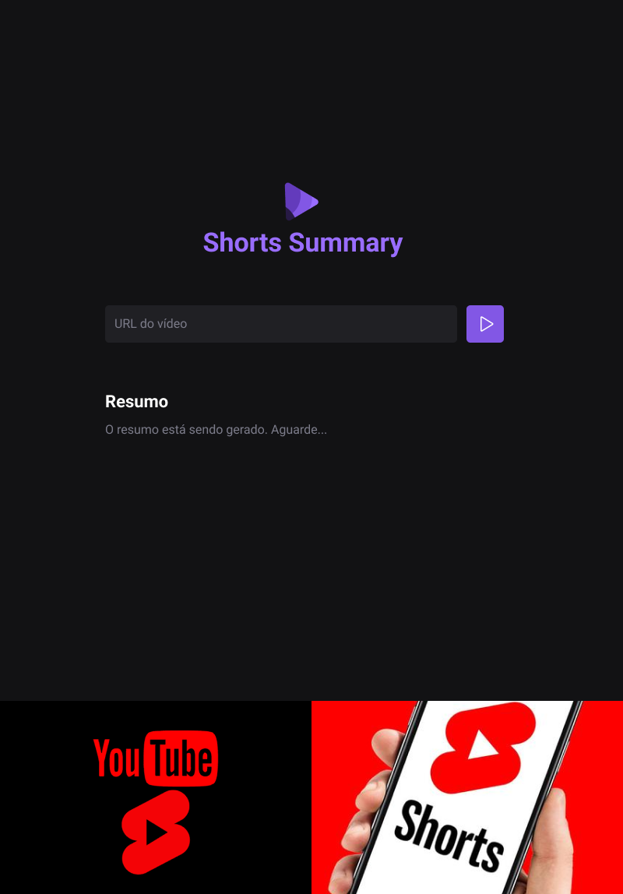

<h1 align="center"> Shorts Summary </h1>

Projeto criado no evento NLWIA da RocketSeat.

  

## 💻 Projeto

Shorts Summary é uma aplicação web para criar resumos de vídeos shorts do YouTube utilizando inteligência artificial para transcrever o conteúdo do vídeo e realizar o resumo do conteúdo.

 Você pode acessar o projeto clicando <a href="https://shorts-summary-sooty.vercel.app/" target="_blank">AQUI</a>! 

## 🚀 Tecnologias

Esse projeto foi desenvolvido com as seguintes tecnologias:

- HTML e CSS
- JavaScript
- Inteligência Artificial
- Git e Github
- Figma

------

<footer>Feito com ♥ by Larissa</footer>
=======
